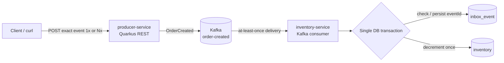

# 02 - Inbox Pattern and Idempotent Kafka Consumers

A deliberately small Quarkus learning project that demonstrates how an **Inbox Pattern** prevents the same Kafka event from applying the same business change more than once.

The important result is simple:

- initial inventory: `100`
- `OrderCreated.quantity`: `2`
- the exact same event is published: `5` times
- final inventory: **`98`**, not `90`

## Stack

- Java 21
- Maven
- Quarkus 3.38.3
- Quarkus REST + Jackson
- Hibernate ORM with Panache
- PostgreSQL
- Flyway
- Quarkus Messaging Kafka
- Apache Kafka
- Docker Compose
- JUnit / `@QuarkusTest`

## Project structure

```text
02-inbox-idempotency/
├── producer-service/
│   ├── pom.xml
│   └── src/main/...
├── inventory-service/
│   ├── pom.xml
│   ├── src/main/...
│   └── src/test/...
├── docker-compose.yml
└── README.md
```

## Architecture



## Event

```json
{
  "eventId": "UUID",
  "eventType": "OrderCreated",
  "orderId": "UUID",
  "productId": "UUID",
  "quantity": 2,
  "occurredAt": "ISO_DATE"
}
```

The demo database is seeded with this product:

```text
productId = 11111111-1111-1111-1111-111111111111
availableQuantity = 100
```

## Why Kafka can deliver a message more than once

Kafka consumers normally provide **at-least-once processing semantics** unless a larger end-to-end design guarantees otherwise. A consumer may finish its database work and then fail before its Kafka offset is successfully committed. When the consumer restarts or the partition is reassigned, Kafka can deliver that record again.

Retries, consumer crashes, rebalances, timeouts, and manual replay can therefore all cause the same logical event to be seen more than once.

## What idempotency means

An operation is idempotent when repeating the same logical request has the same business effect as executing it once.

For this project, processing one `OrderCreated` event with `quantity = 2` changes inventory from `100` to `98`. Processing the exact same event five times must still leave inventory at `98`.

## What the Inbox Pattern solves

The inventory service stores the identity of every successfully processed event in `inbox_event`.

For every incoming `OrderCreated` event it does this inside one database transaction:

1. Look up `InboxEvent` by `eventId`.
2. If it already exists, log `DUPLICATE EVENT IGNORED <eventId>` and return.
3. Otherwise log `PROCESSING NEW EVENT <eventId>`.
4. Modify inventory.
5. Insert the inbox record.
6. Commit both changes together.

`event_id` is also the primary key of `inbox_event`, so the database enforces uniqueness.

## Why eventId must be globally unique

If two different real events accidentally share the same ID, the second one will be treated as a duplicate and ignored. A UUID gives every produced event a practically unique identity across services, processes, restarts, and time.

The important rule is: create the event ID once when the event is created. Retries and republishes of that same logical event must reuse the same ID.

## Why the inbox record and business change share one transaction

If inventory and inbox writes were separate transactions, bad failure windows would exist. By placing both writes in one database transaction, either both commit or both roll back.

## REST endpoints

### producer-service - port 8081

```text
POST /events/order-created
POST /events/order-created/repeat?times=5
```

### inventory-service - port 8082

```text
GET /inventory/{productId}
GET /inbox
GET /inbox/{eventId}
```

## Start the project

From the project root:

```bash
docker compose up -d
```

In a second terminal:

```bash
cd inventory-service
mvn quarkus:dev
```

In a third terminal:

```bash
cd producer-service
mvn quarkus:dev
```

## Run the tests

```bash
cd inventory-service
mvn test
```

The tests verify first delivery, duplicate delivery, five duplicate deliveries, independent event IDs, and transaction rollback.

## curl examples

Create one fixed event:

```bash
cat > /tmp/order-created.json <<'JSON'
{
  "eventId": "aaaaaaaa-aaaa-aaaa-aaaa-aaaaaaaaaaaa",
  "eventType": "OrderCreated",
  "orderId": "bbbbbbbb-bbbb-bbbb-bbbb-bbbbbbbbbbbb",
  "productId": "11111111-1111-1111-1111-111111111111",
  "quantity": 2,
  "occurredAt": "2026-08-22T18:30:00Z"
}
JSON
```

Publish five times:

```bash
curl -s -X POST \
  -H 'Content-Type: application/json' \
  --data-binary @/tmp/order-created.json \
  'http://localhost:8081/events/order-created/repeat?times=5' | jq
```

Read inventory:

```bash
curl -s http://localhost:8082/inventory/11111111-1111-1111-1111-111111111111 | jq
```

Read inbox:

```bash
curl -s http://localhost:8082/inbox | jq
curl -s http://localhost:8082/inbox/aaaaaaaa-aaaa-aaaa-aaaa-aaaaaaaaaaaa | jq
```

## Expected logs

```text
PROCESSING NEW EVENT aaaaaaaa-aaaa-aaaa-aaaa-aaaaaaaaaaaa
DUPLICATE EVENT IGNORED aaaaaaaa-aaaa-aaaa-aaaa-aaaaaaaaaaaa
DUPLICATE EVENT IGNORED aaaaaaaa-aaaa-aaaa-aaaa-aaaaaaaaaaaa
DUPLICATE EVENT IGNORED aaaaaaaa-aaaa-aaaa-aaaa-aaaaaaaaaaaa
DUPLICATE EVENT IGNORED aaaaaaaa-aaaa-aaaa-aaaa-aaaaaaaaaaaa
```

## Kafka commands

```bash
docker compose exec kafka /opt/kafka/bin/kafka-topics.sh --bootstrap-server kafka:9092 --list
```

```bash
docker compose exec kafka /opt/kafka/bin/kafka-console-consumer.sh --bootstrap-server kafka:9092 --topic order-created --from-beginning
```

Publish directly to Kafka five times:

```bash
for delivery in 1 2 3 4 5; do
  cat /tmp/order-created.json | docker compose exec -T kafka \
    /opt/kafka/bin/kafka-console-producer.sh \
    --bootstrap-server kafka:9092 \
    --topic order-created
done
```

## SQL inspection commands

```bash
docker compose exec postgres psql -U inventory -d inventory
```

```sql
SELECT product_id, available_quantity FROM inventory;
SELECT event_id, event_type, received_at, processed_at FROM inbox_event ORDER BY received_at;
SELECT COUNT(*) FROM inbox_event WHERE event_id = 'aaaaaaaa-aaaa-aaaa-aaaa-aaaaaaaaaaaa';
```

## Reset the demo

```bash
docker compose down -v
docker compose up -d
```

# Manual duplicate-message test - exact reproduction

1. Reset with `docker compose down -v && docker compose up -d`.
2. Start `inventory-service` on `8082` and `producer-service` on `8081`.
3. Confirm inventory starts at `100`.
4. Create `/tmp/order-created.json` using the fixed event above.
5. POST it to `/events/order-created/repeat?times=5`.
6. Confirm the logs show one `PROCESSING NEW EVENT` and four `DUPLICATE EVENT IGNORED` messages.
7. Confirm inventory is `98`, not `90`.
8. Confirm the inbox contains exactly one row for event `aaaaaaaa-aaaa-aaaa-aaaa-aaaaaaaaaaaa`.

That proves five Kafka deliveries resulted in **one business operation**.
